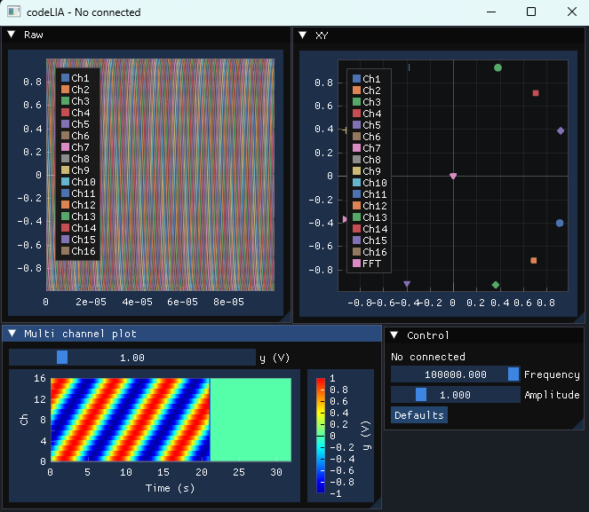
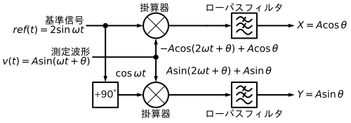
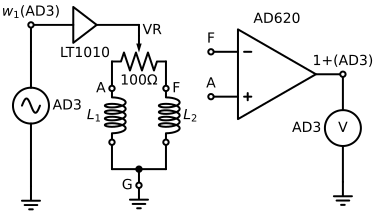
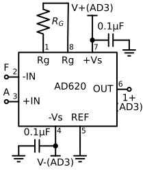
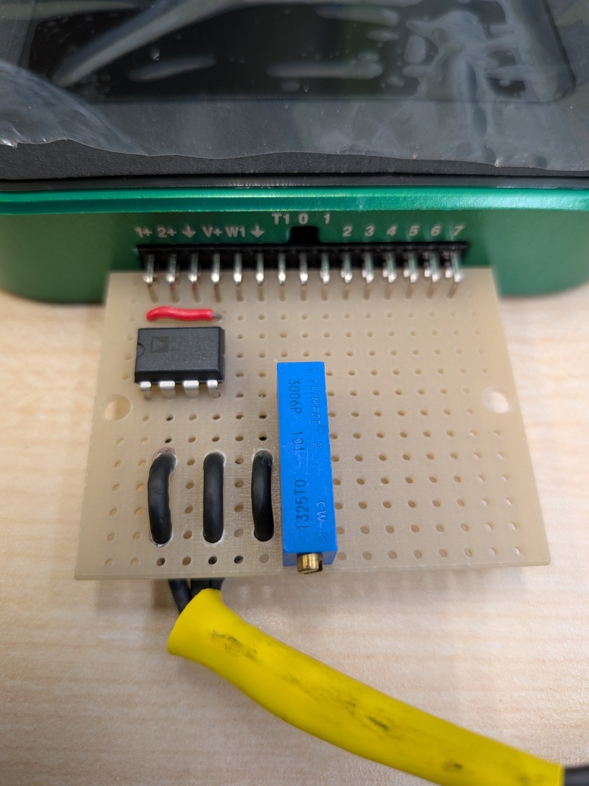
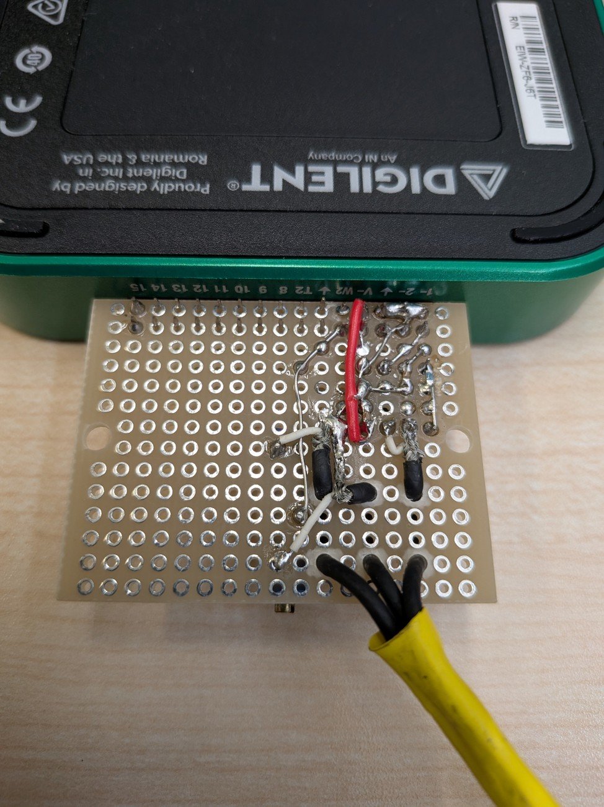

# vscodeLIA (Template of Simple Software Lock-in Amplifier)


|  |
| --- |
| 図1 Hard copy |
---

## 概要

**vscodeLIA** は、DAQ (Data Acquisition) を利用して動作する、C++製のシンプルなソフトウェア・ロックインアンプ(LIA)です。

* **主な機能:**
    * Digilent製DAQ([Analog Discovery](https://digilent.com/shop/analog-discovery-3/))を用いた信号の測定・集録
      * Daq.hとMakefileを書き換えることで、他のDAQ(例えばNI-DAQ)に対応させることも可能です。
    * [ImPlot](https://github.com/epezent/implot)を用いた波形のリアルタイム描画
    * 位相敏感検波(同期検波)等による信号処理(未実装)
      * **※注意:** 学習を目的の一つとしているため、位相敏感検波処理は**あえて未実装**にしています。
    * オープンソースかつ軽量な **Visual Studio Code + GCC (MinGW-w64)** の組み合わせで開発できるように設計されています。

* **このリポジトリの発展形:**
より実用的なフル機能のソフトウェア・ロックインアンプをお探しの場合は、[LIA (daigokk/LIA)](https://github.com/daigokk/LIA/) をご参照ください。
* **このリポジトリの目的:**
データ集録・GUI描画・信号処理を組み合わせた「計測アプリの学習用サンプルコード」、または「新規計測プロジェクトの雛形 (テンプレート)」としての使用を想定しています。


|  |
| --- |
| 図2 位相敏感検波のブロック図 |

* [答え] 以下のコードは図2のブロック図を具現化したものです。`Daq.h`に記載の`psd`関数に以下を記述すると、プローブの状態に合わせてリアルタイムにXYウィンドウの輝点が移動します。

```c++
void psd(Cfg* pCfg){
    double ch1x = 0, ch1y = 0;
    for (size_t i = 0; i < pCfg->rawData.ch1.size(); ++i) {
        double wt = 2 * pCfg->PI_ * pCfg->excitation.frequency * pCfg->rawData.dt * i;
        ch1x += pCfg->rawData.ch1[i] * 2 * sin(wt);
        ch1y += pCfg->rawData.ch1[i] * 2 * cos(wt);
    }
    pCfg->buffer.ch1.x = ch1x / pCfg->rawData.ch1.size();
    pCfg->buffer.ch1.y = ch1y / pCfg->rawData.ch1.size();
}
```

* 可能であれば、FFTを使って同様の結果を得られることを確認してみてください。様々な条件においてどちらが優れているか比較してみるのもよいでしょう。


---

## ハードウェア

|   |
| --- |
| 図3 回路図 |

|  |  |
| --- | --- |
| 図4 基板表 | 図5 基板裏 |

  | 部品 | 型番 | 備考 |
  | ---- | ---- | ---- |
  | DAQ | Digilent Analog Discovery 3 | [Analog Discovery 3: 125 MS/s USB Oscilloscope, Waveform Generator, Logic Analyzer, and Variable Power Supply](https://digilent.com/reference/test-and-measurement/analog-discovery-3/start) |
  | L型ピンソケット | 2×15 | https://akizukidenshi.com/catalog/g/g113419/ |
  | ブレッドボード |  47×36mm  | https://akizukidenshi.com/catalog/g/g111960/ |
  | 計装アンプ | Analog Devices AD620ANZ | https://akizukidenshi.com/catalog/g/g113693/ |
  | ゲイン設定用抵抗(40dB) | 510Ω | [See "Gain Selection" on page 15 of the AD620 datasheet.](https://www.analog.com/media/en/technical-documentation/data-sheets/AD620.pdf) |
  | コンデンサ | 0.1uF×2 | https://akizukidenshi.com/catalog/g/g110149/ |
  | (表面実装コンデンサ) | 0.1uF×2 | https://akizukidenshi.com/catalog/g/g116143/ |
  | 可変抵抗器 | 100Ω | https://akizukidenshi.com/catalog/g/g117821/ |
  | 同軸ケーブル | 特性インピーダンス50Ω | https://akizukidenshi.com/catalog/g/g116943/|
  | $L_1$, Sensor coil| 励磁周波数で50Ω程度 | 例えば https://akizukidenshi.com/catalog/g/g116967/ |
  | $L_2$, Reference coil | 励磁周波数で50Ω程度 | 例えば https://akizukidenshi.com/catalog/g/g116967/ |
  | (必要であれば)メスコネクタ | 多治見無線電機 PRC03-12A10-7F10.5 | 探傷器側コネクタ |
---

## 開発環境・技術スタック

* **エディタ / IDE:** [Visual Studio Code](https://code.visualstudio.com/download)
* **コンパイラ:** [Mingw-w64](https://github.com/niXman/mingw-builds-binaries/releases/) (GCC for Windows)
* **対象OS:** Windows 10 / 11 (64-bit)

### 依存ライブラリ・SDK

本プロジェクトでは以下のサードパーティ製ライブラリ・SDKを利用しています。

| ライブラリ / SDK | 概要 / 用途 |
| --- | --- |
| **[Digilent WaveForms SDK](https://digilent.com/reference/software/waveforms/waveforms-3/start)** | Analog Discovery等のDigilentハードウェア制御用SDK |
| **[GLFW](https://www.glfw.org/)** | OpenGLウィンドウ作成および入力処理 |
| **[Dear ImGui](https://github.com/ocornut/imgui)** | 軽量グラフィカルユーザーインターフェース (GUI) |
| **[ImPlot](https://github.com/epezent/implot)** | Dear ImGui向けのリアルタイムプロット・グラフ描画拡張 |
| **[pocketfft](https://github.com/mreineck/pocketfft)** | ヘッダーオンリーのFFT (高速フーリエ変換) ライブラリ |

---

## 開発環境のセットアップ (Windows)

以下のステップ順にセットアップを行ってください。

### 1. Digilent WaveForms のインストール

計測用ドライバおよびSDKを取得するためにインストールします。

1. [WaveForms 過去バージョン / ダウンロードページ](https://digilent.com/reference/software/waveforms/waveforms-3/previous-versions) にアクセスします。
1. Windows用のインストーラー（例: `digilent.waveforms_vX.X.X_64bit.exe`）をダウンロードして実行します。
1. インストール時の設定はデフォルトでよいです。

### 2. Mingw-w64 (C++コンパイラ) の配置とパス設定

1. [niXman/mingw-builds-binaries](https://github.com/niXman/mingw-builds-binaries/releases/)にアクセスします。
1. Mingw-w64 のアーカイブ(例: `x86_64-16.1.0-release-win32-seh-ucrt-rt_v14-rev1.7z`)をダウンロードします。
1. ダウンロードした `.7z` ファイルを解凍し、中身の `mingw64` フォルダを以下のディレクトリへ移動（コピー）します。
   ```text
   C:\Program Files\mingw64
   ```
   *(※ `C:\Program Files\mingw64\bin\g++.exe` が存在する構造になるように配置してください)*

1. **環境変数 (PATH) の設定:**
   * キーボードの `Win + R` を押し、`sysdm.cpl` と入力して Enter（または 「スタートメニュー」→「設定」→「システム」→「バージョン情報」→「システムの詳細設定」）。
   * **「環境変数(N)…」** ボタンをクリック。
   * 「システム環境変数」欄の一覧から **`Path`** を選択し、**「編集(E)…」** をクリック。
   * **「新規(N)」** を押し、以下を入力して OK を押します。
     ```text
     C:\Program Files\mingw64\bin
     ```


1. **動作確認:**
  コマンドプロンプトを開き、以下を実行してバージョンが表示されれば設定完了です。表示されない場合、コマンドプロンプトを再起動する、または一度ログアウトすると、環境変数の設定が更新されるのでうまくいくかもしれません。
    ```cmd
    g++ --version
    ```


### 3. Visual Studio Code のセットアップ

1. [VS Code 公式サイト](https://code.visualstudio.com/download) からインストーラーを取得し、インストールします。
1. VS Codeを起動し、左側の拡張機能タブ（`Ctrl + Shift + X`）を開き、以下の拡張機能を検索してインストールします。
   * **C/C++** (`ms-vscode.cpptools`)
   * **C/C++ Extension Pack** (`ms-vscode.cpptools-extension-pack`)
   * **Makefile Tools** (`ms-vscode.makefile-tools`)


---

## プロジェクトの取得方法

いずれかの方法でソースコードを取得してください。

### 方法A: ZIPダウンロードを使用する場合

1. リポジトリページ上部の **「<> Code」** ボタン → **「Download ZIP」** をクリックします。
1. ダウンロードしたZIPファイルを任意の場所に解凍します。
1. VS Codeのメニューから **「ファイル」→「フォルダーを開く...」** を選択し、解凍したフォルダを開きます。


### 方法B: Gitを使用する場合

1. [Git for Windows](https://www.google.com/search?q=https://git-scm.com/install/windows) をインストールします。
1. VS Codeを起動し、上部検索バー（Command Center）または `Ctrl + Shift + P` でコマンドパレットを開きます。
1. `Git: Clone`（Git: クローン）と入力・選択し、以下のURLを入力します。
   ```text
   https://github.com/daigokk/vscodeLIA.git
   ```


1. 保存先のフォルダを選択し、クローン完了後に表示されるダイアログで **「開く」** を選択します。


---


## ビルドおよび実行方法

* 本プロジェクトは VS Code の **Makefile Tools** 拡張機能を利用してビルド・デバッグを行うように構成されています。
* makeを用いることで、ビルド時間が大幅に短縮されます。

1. **Makefile Toolsの初回認識:**
フォルダを開いた後、左側サイドバーに **C/C++のアイコンがついた「Makefile Tools」**（または `MAKEFILE` タブ）が表示されます。
*※表示されない場合は、`main.cpp` などを開くか、`F5` キーを一回押すとアクティブ化されます。*


2. **Makefile設定の確認:**
Makefile Tools のパネル内で、以下のように設定されているか確認・指定します。

* **構成 (Configuration):** `Default`
* **ターゲットのビルド (Build target):** `all`
* **起動ターゲット (Launch target):** `vscodeLIA.exe`
* **Makefile:** `Makefile`
* **Make メイク:** `mingw32-make.exe`


3. **ビルドと実行:**
* **実行 (Run):** Makefile Tools パネルの上部にある **再生ボタン（右三角 ▶）** をクリックします。自動的に `mingw32-make` が呼び出されてコンパイル・ビルドが実行され、完了後に `vscodeLIA.exe` が起動します。
* **デバッグ実行 (Debug):** **虫アイコン** をクリックします。ブレイクポイントの設定、ステップ実行、変数レジスタの監視を行いながらデバッグが可能です。


---

## 補足

* **Visual Studio (MSVC) との比較:**
Visual Studio（IDE）を使用すると Makefile やデバッガの手動設定なしで開発を始められますが、商業利用時は有償であるなどの制限があります。本プロジェクトは、オープンソースかつ軽量な **VS Code + GCC (MinGW-w64)** の組み合わせで開発できるように設計されています。VS Codeでももっと簡単にC++開発ができるかもしれません。
* **WaveForms SDKのリンクエラーが発生する場合:**
WaveFormsがデフォルトのパス（`C:\Program Files (x86)\Digilent\WaveFormsSDK` 等）にインストールされているか、`Makefile` 内のライブラリインクルードパス・リンクパスを確認してください。
