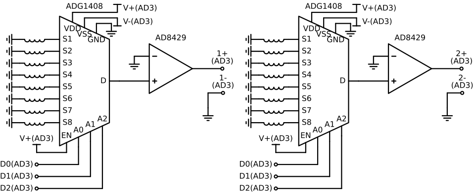

# vscodeLIA (Template of Simple Software Lock-in Amplifier)


https://github.com/user-attachments/assets/82d80d7d-aa7a-41a0-967f-187cdc8ed578

---

## 1. 概要

図1に示す**vscodeLIA** は、Data Acquisition Device (データ収集装置、以下DAQ) を利用して動作する、C++製のシンプルなソフトウェア・ロックインアンプ(LIA)です。

* **このプロジェクトの目的:**
データ集録・GUI描画・信号処理を組み合わせた、以下のような使用を想定しています。
  * **計測アプリの学習用サンプルコード**
  * **新規計測プロジェクトの雛形 (テンプレート)**
  * [職業能力開発総合大学校](https://www.uitec.jeed.go.jp/) 電気工学専攻 3年時プレゼミ([応用センシング研究室](https://www.uitec.jeed.go.jp/kenkyu/laboratory/lab039/index.html))の課題

* **主な機能:**
    * Digilent製DAQ([Analog Discovery](https://digilent.com/shop/analog-discovery-3/), 以下AD3)を用いた信号の測定・集録
      * `Daq.h`、`Daq.cpp`及び`Makefile`を書き換えることで、他のDAQ(例えばNI-DAQ)に対応させることも可能です。
    * [ImPlot](https://github.com/epezent/implot)を用いた波形のリアルタイム描画
    * [位相敏感検波](https://www.youtube.com/watch?v=pHyuB1YW4qY)(同期検波)等による信号処理(図2参照、未実装)
      * **※注意:** 学習を目的の一つとしているため、位相敏感検波処理は**あえて未実装**にしています。
    * オープンソースである **[Visual Studio Code](https://code.visualstudio.com/) + GCC ([MinGW-w64](https://www.mingw-w64.org/))** の組み合わせで開発できるように設計されています。

* **このプロジェクトの発展形:**
より実用的なフル機能のソフトウェア・ロックインアンプをお探しの場合は、[LIA (daigokk/LIA)](https://github.com/daigokk/LIA/) をご参照ください。


|  |
| --- |
| 図2. 位相敏感検波のブロック図 |

* [参考] 以下のコードは図2のブロック図を具現化したものです。`Psd.h`に記載の`Psd::calc`関数に以下を記述すると、プローブの状態に合わせてリアルタイムにXYウィンドウの輝点が移動します。

```c++
inline std::pair<double, double> Psd::calc(const double* inData){
    const size_t N = this->sampleCount;
    const double DT = this->dt;
    const double FREQ = this->frequency;
    double xSum = 0.0;
    double ySum = 0.0;
    // TODO: ここに位相敏感検波のコードを入力
    for (std::size_t i = 0; i < N; ++i) {
        double wt = 2.0 * acos(-1) * FREQ * DT * i;
        xSum += inData[i] * 2 * sin(wt);
        ySum += inData[i] * 2 * cos(wt);
    }
    // ここまで
    return {xSum / N, ySum / N};
}
```

---

## 2. ハードウェア

* 図3、図4、及び表1は、自己誘導差動型の渦電流プローブのブリッジ・プリアンプの回路と必要な部品を示しています。ご自身のアプリケーションに合わせて設計・製作してください。
* AD3のWavegen(W1,W2)の最大出力電流は30mA程度です。Wavegenの出力電圧を上げすぎると波形がゆがみます(例えば周波数が低い(力率が高い、つまり電圧と電流の位相が近い)場合、測定電圧の山と谷が平らになる)。電圧(電力)が必要であればWavegenの出力と負荷の間に`LT1010`(最大出力電流150mA)のようなパワー・バッファを入れるとよいでしょう。なお、パワー・バッファ(またはオペアンプ)の電源をAD3からとる場合、AD3の直流電源(Supplies)の最大出力電流は400mA程度(AD3にACアダプターをつなぐと800mA程度まで拡大可能)であることに注意してください。

|   |
| --- |
| 図3. 回路図 |

|  |  |
| --- | --- |
| (a) 表 | (b) 裏 |
| 図4. 電子回路基板 |  |

表1. 部品一覧
  | 部品 | 型番 | 備考 |
  | ---- | ---- | ---- |
  | DAQ | Digilent, Analog Discovery 3 | [Analog Discovery 3: 125 MS/s USB Oscilloscope, Waveform Generator, Logic Analyzer, and Variable Power Supply](https://digilent.com/reference/test-and-measurement/analog-discovery-3/start) |
  | L型ピンソケット | 2×15 | https://akizukidenshi.com/catalog/g/g113419/ |
  | ブレッドボード |  47×36mm  | https://akizukidenshi.com/catalog/g/g111960/ |
  | 計装アンプ | Analog Devices, AD620ANZ | https://akizukidenshi.com/catalog/g/g113693/ |
  | ゲイン設定用抵抗(40dB) | 510Ω | [See "Gain Selection" on page 15 of the AD620 datasheet.](https://www.analog.com/media/en/technical-documentation/data-sheets/AD620.pdf) |
  | コンデンサ | 0.1uF×2 | https://akizukidenshi.com/catalog/g/g110149/ |
  | (表面実装コンデンサ) | 0.1uF×2 | https://akizukidenshi.com/catalog/g/g116143/ |
  | 可変抵抗器 | 100Ω | https://akizukidenshi.com/catalog/g/g117821/ |
  | 同軸ケーブル | 特性インピーダンス50Ω | https://akizukidenshi.com/catalog/g/g116943/|
  | $L_1$, Sensor coil| 励磁周波数で50Ω程度 | 例えば https://akizukidenshi.com/catalog/g/g116967/ |
  | $L_2$, Reference coil | 励磁周波数で50Ω程度 | 例えば https://akizukidenshi.com/catalog/g/g116967/ |
  | (必要であれば)メスコネクタ | 多治見無線電機, PRC03-12A10-7F10.5 | 探傷器側コネクタ |
---

## 3. 開発環境のセットアップ (Windows)

本プロジェクトでは開発環境として以下を使用します。

* **DAQ:** [Digilent Analog Discovery 3](https://digilent.com/shop/analog-discovery-3/)
* **コンパイラ:** [Mingw-w64](https://github.com/niXman/mingw-builds-binaries/releases/) (GCC for Windows)
* **エディタ / IDE:** [Visual Studio Code (VS Code)](https://code.visualstudio.com/)
* **対象OS:** Windows 10 / 11 (64-bit)

以下を参考にセットアップを行ってください。

### ⚡ Digilent WaveForms のインストール

DAQのドライバおよびSDKを取得するためにインストールします。

1. [WaveForms 過去バージョン / ダウンロードページ](https://digilent.com/reference/software/waveforms/waveforms-3/previous-versions) にアクセスします。
1. Windows用のインストーラー（例: `digilent.waveforms_vX.X.X_64bit.exe`）をダウンロードして実行します。
1. インストール時の設定はデフォルトでよいです。

### 🔄 Mingw-w64 (C++コンパイラ) の配置とパス設定

1. [niXman/mingw-builds-binaries](https://github.com/niXman/mingw-builds-binaries/releases/)にアクセスします。なおx64以外のアーキテクチャ(ARM)にも対応している[llvm-mingw](https://github.com/mstorsjo/llvm-mingw)というものもあります。
1. Mingw-w64 のアーカイブ(例: `x86_64-16.1.0-release-win32-seh-ucrt-rt_v14-rev1.7z`)をダウンロードします。
1. ダウンロードした `.7z` ファイルを解凍し、中身の `mingw64` フォルダを以下のディレクトリへ移動します。
   ```text
   C:\Program Files\mingw64
   ```
   *(※ `C:\Program Files\mingw64\bin\g++.exe` が存在する構造になるように配置してください)*

1. **環境変数 (PATH) の設定:**
   * キーボードの `Win + R` を押し、`sysdm.cpl` と入力して Enter（または 「スタートメニュー」→「設定」→「システム」→「バージョン情報」→「システムの詳細設定」）。
   * **「環境変数(N)…」** ボタンをクリック。
   * 「システム環境変数」欄の一覧から **`Path`** を選択し、**「編集(E)…」** をクリック。
   * **「新規(N)」** を押し、以下を入力して OK を押します。
     ```text
     C:\Program Files\mingw64\bin
     ```


1. **動作確認:**
  コマンドプロンプトを開き、以下を実行してバージョンが表示されれば設定完了です。表示されない場合、コマンドプロンプトを再起動する、または一度ログアウトすると、環境変数の設定が更新されるのでうまくいくかもしれません。
    ```cmd
    g++ --version
    ```


### 📝 VS Code のセットアップ

1. [VS Code 公式サイト](https://code.visualstudio.com/download) からインストーラーを取得し、インストールします。なお、VS Codeからテレメトリやトラッキング機能(使用状況等をMicrosoftに自動的に送信する機能)を無効化した[VSCodium](https://vscodium.com/)というものもあります。
1. VS Codeを起動し、左側の拡張機能タブ（`Ctrl + Shift + X`）を開き、以下の拡張機能を検索してインストールします。
   * **C/C++** (`ms-vscode.cpptools`)
   * **C/C++ Extension Pack** (`ms-vscode.cpptools-extension-pack`)
   * **Makefile Tools** (`ms-vscode.makefile-tools`)


---

## 4. プロジェクトの取得方法

* いずれかの方法でソースコードを取得してください。

### 方法A: ZIPダウンロードを使用する場合

1. リポジトリページ上部の **「<> Code」** ボタン → **「Download ZIP」** をクリックします。
1. ダウンロードしたZIPファイルを任意の場所に解凍します。
1. VS Codeのメニューから **「ファイル」→「フォルダーを開く...」** を選択し、解凍したフォルダを開きます。


### 方法B: Gitを使用する場合

1. [Git for Windows](https://www.google.com/search?q=https://git-scm.com/install/windows) をインストールします。
1. VS Codeを起動し、上部検索バー（Command Center）または `Ctrl + Shift + P` でコマンドパレットを開きます。
1. `Git: Clone`（Git: クローン）と入力・選択し、以下のURLを入力します。
   ```text
   https://github.com/daigokk/vscodeLIA.git
   ```
1. 保存先のフォルダを選択し、クローン完了後に表示されるダイアログで **「開く」** を選択します。


* このプロジェクトは表2に示すライブラリに依存しています。偉大なる先人に感謝！なお、これらのライブラリはプロジェクトに含まれているため新たにダウンロードする必要はありません。

表2. 依存ライブラリ一覧
| ライブラリ | 概要 / 用途 |
| --- | --- |
| **[Digilent WaveForms SDK](https://digilent.com/reference/software/waveforms/waveforms-sdk/reference-manual)** | Analog Discovery等のDigilentハードウェア制御用SDK |
| **[Digilent/WaveForms-SDK-Getting-Started-Cpp](https://github.com/Digilent/WaveForms-SDK-Getting-Started-Cpp)** | 上記SDKのラッパー。このラッパーを参考に`Daq.h`を作成。 |
| **[GLFW](https://www.glfw.org/)** | OpenGLウィンドウ作成および入力処理 |
| **[Dear ImGui](https://github.com/ocornut/imgui)** | 軽量グラフィカルユーザーインターフェース (GUI) |
| **[ImPlot](https://github.com/epezent/implot)** | Dear ImGui向けのリアルタイムプロット・グラフ描画拡張 |
| **[pocketfft](https://github.com/mreineck/pocketfft)** | ヘッダーオンリーのFFT (高速フーリエ変換) ライブラリ |

---


## 5. ビルドおよび実行方法

* 本プロジェクトは VS Code の **Makefile Tools** 拡張機能を利用してビルド・デバッグを行うように構成されています。
* makeを用いることで、修正していない`cpp`ファイルのビルドが除外されるので、2回目のビルドからビルド時間が大幅に短縮されます。

1. **Makefile Toolsの設定:**
    * フォルダを開いた後、左側サイドバーに **C/C++のアイコンがついた「Makefile Tools」**（または `MAKEFILE` タブ）が表示されます。
        * *※表示されない場合は、左側サイドバーを右クリックし、`Makefile`にチェックをつけてください。もしくは`F5`キーを一回押すと、`Makefile`が認識されて左側サイドバーに *「Makefile Tools」が現れることがあります。*
    * Makefile Tools のパネル内で、以下のように設定します。
        * **構成 (Configuration):** `Default`
        * **ターゲットのビルド (Build target):** `all`
        * **起動ターゲット (Launch target):** `vscodeLIA.exe`
        * **Makefile Path:** `Makefile`
        * **Make Path:** `mingw32-make.exe`

1. **ビルドと実行:**
    * **実行 (Run):** Makefile Tools パネルの上部にある **再生ボタン（右三角 ▶）** をクリックします。自動的に `mingw32-make` が呼び出されてビルド(コンパイル⇒リンク)が実行され、完了後に `vscodeLIA.exe` が起動します。１回目のビルドは数十秒かかります。最適化オプション(`-O2`)を入れるとビルド時間が数倍になるので、プログラムが完成してから入れましょう。ちなみに、Makefileでビルドオプションを変更したらターミナルから`mingw32-make clean`(または Makefile Tools の「現在のターゲットをクリーンしてビルドします」を選択)するのを忘れずに。
    * **デバッグ実行 (Debug):** **虫アイコン** (🐞←これのモノクロの線画風) をクリックします。ブレイクポイントの設定、ステップ実行、変数レジスタの監視を行いながらデバッグが可能です。

1. **プログラム説明**
   * [`main.cpp`](https://github.com/daigokk/vscodeLIA/blob/main/main.cpp)をみると`Config`クラス、`Daq`クラス及び`Gui`クラスが呼び出されています。これらは本プロジェクトの中核的なプログラムです。
     * `Config`: 測定に関する設定および測定値を保存するクラス
     * `Daq`: DAQの制御をするクラス
       * `daq.start();`: `daq.stop();`するまでDAQは波形を測定し続けます。
     * `Gui`: 親ウィンドウを描画するGLFW、ウィンドウ上にボタンやチャートなどのウィジェットを描画するImGui、ImPlotの初期設定等を行うクラス
   * 子ウィンドウは以下の関数で描画されています。
     * `RawWindow`: DAQが測定した波形を時間軸で表示する
     * `XyWindow`: 位相敏感検波した値を複素平面上に表示する
     * `ControlWindow`: DAQの出力する波形(周波数、振幅)を制御する

1. **補足:**

    * **ビルドができない場合:** 3章の「Mingw-w64 (C++コンパイラ) の配置とパス設定」と5章の「Makefile Toolsの設定」が正しくできているか確認してください。
    * **[Visual Studio](https://visualstudio.microsoft.com/) (Microsoft Visual C++, MSVC) との比較:** MSVCを使用するとコンパイラの追加インストールや Makefile の手動設定なしで開発を始められます。商業利用時は有償ではありますが、MSVCは素晴らしいツールです。本プロジェクトは、追加インストールと手動設定がやや多いですがオープンソースである **VS Code + GCC (MinGW-w64)** の組み合わせで開発できるように設計されています。VS Codeでもっと簡単にC++開発ができる自分好みの方法を探すのもよいかもしれません。


---
## 6. 課題

* `Psd.h`に記載の`Psd::calc`関数を完成させてください。
* (オプション) `Config.h`に記載の`fft`関数を完成させ、FFTを使ってPSDと同様の結果を得られることを確認してみてください。`fft`関数をどこから呼び出すかも考えてみてください。様々な条件においてどちらが優れているか比較してみるのもよいでしょう。入力波形を矩形波にすることで、高調波成分は正弦波の時より大きくなります。この方法の利点は、一度に複数の周波数成分を得られることです。
```c++
void fft(Config* pCfg) {
    const auto& in_data = pCfg->rawData.ch[0];
    const size_t N = in_data.size();
    const size_t N_HARMONICS_ = pCfg->fftBuffer.numHarmonics_x.size();

    // 1. pocketfft実行用の入出力形状およびストライドの設定
    pocketfft::shape_t shape = { N };
    pocketfft::stride_t stride_in = { sizeof(double) };
    pocketfft::stride_t stride_out = { sizeof(std::complex<double>) };
    pocketfft::shape_t axes = { 0 };

    // Real-to-Complex FFT (r2c) の出力サイズは N/2 + 1
    std::vector<std::complex<double>> fft_out(N / 2 + 1);

    // 2. FFTの実行 (r2c: 実数入力 -> 複素数出力)
    // 引数: shape, stride_in, stride_out, axes, forward(true), in_ptr, out_ptr, scale(1.0)
    pocketfft::r2c(
        shape,
        stride_in,
        stride_out,
        axes,
        pocketfft::FORWARD,
        in_data.data(),
        fft_out.data(),
        1.0
    );

    // 3. 周波数分解能 df = 1 / (N * dt)
    const double df = 1.0 / (static_cast<double>(N) * pCfg->rawData.dt);
    const double f0 = pCfg->excitation.frequency;

    // 正規化用係数（DFT結果を平均振幅に戻すため 2/N を乗算）
    const double scale = 2.0 / static_cast<double>(N);

    // 4. 各倍波に対応する周波数インデックス（ビン）を特定して格納
    for (int i = 0; i < N_HARMONICS; ++i) {
        // 抽出対象の高調波倍率 (1倍, 3倍, 5倍, ...)
        const double target_freq = f0 * (i * 2 + 1);
        
        // 最も近い周波数ビンのインデックスを計算
        const size_t bin_idx = static_cast<size_t>(std::round(target_freq / df));

        // ナイキスト周波数（N/2）以下の範囲内にあるか確認
        if (bin_idx < fft_out.size()) {
            // スケーリングを適用して実部(X)と虚部(Y)を格納
            pCfg->fftBuffer.numHarmonics_x[i] = fft_out[bin_idx].real() * scale;
            pCfg->fftBuffer.numHarmonics_y[i] = -fft_out[bin_idx].imag() * scale;
        }
    }
}
```
* AD3はアナログ入力が2チャンネルしかありません。8:1のマルチプレクサを使って2×8=16チャンネルにしてみてください。
  |  |
  | --- |
  | 図5. マルチプレクサを用いた相互誘導検出部の多チャンネル回路 |
* (オプション) 初期設定では、2msごとに 10000[Sample]/100[MSample/s]=0.1[ms] 分だけAD変換しています(`Config.h`で変更可能)。2msはUSBの制限から決定しました。この方式の利点はPSDの実装が簡単(平均を使える、FFTを使える)であること、100MS/sの高速なAD変換ができること、等が挙げられます。しかしながら全体の時間の 0.1[ms]/[2ms]=5[%] しか使っていません。検出信号の95%は捨てていることを意味します。言い換えると2msの間プローブの検出信号が一定の場合は、問題ないです。この制限(95%を捨てる)は、AD変換の速度を落とすことで使えるようになる、DAQのストリーミング記録(100%使う)を用いることで解決できます。AD変換の速度を落とすことは検出周波数の最大値が下がることを意味しますが([ナイキストのサンプリング定理](https://ja.wikipedia.org/wiki/%E6%A8%99%E6%9C%AC%E5%8C%96%E5%AE%9A%E7%90%86))、AD変換の前段に[スーパーヘテロダイン](https://ja.wikipedia.org/wiki/%E3%83%98%E3%83%86%E3%83%AD%E3%83%80%E3%82%A4%E3%83%B3)を用いることでその制限も回避することができます。何を言っているのかわかったでしょうか？ご理解いただけたら、ハードウェアおよびソフトウェアを改造して、信号の取りこぼしのない、かつ100kHzの検出信号を検波できるLIAを実装してみてください。
* (オプション) 追加したい機能はありませんか？その機能を実装してみましょう。[LIA (daigokk/LIA)](https://github.com/daigokk/LIA/) が参考になるかもしれません。
* (オプション) C++からメモリ安全なRustに書き換えてみましょう。

---
